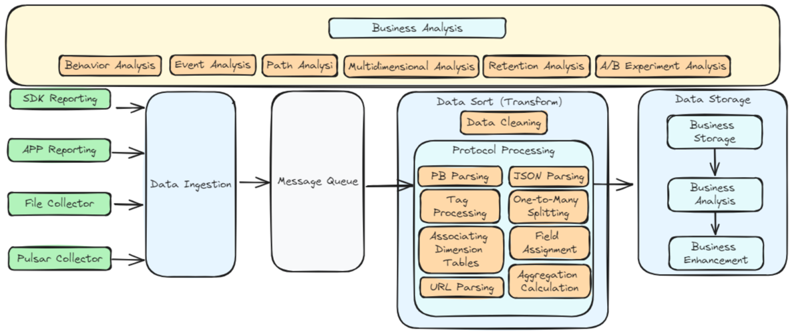
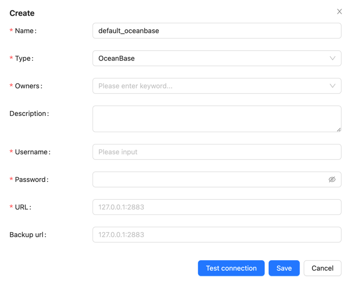
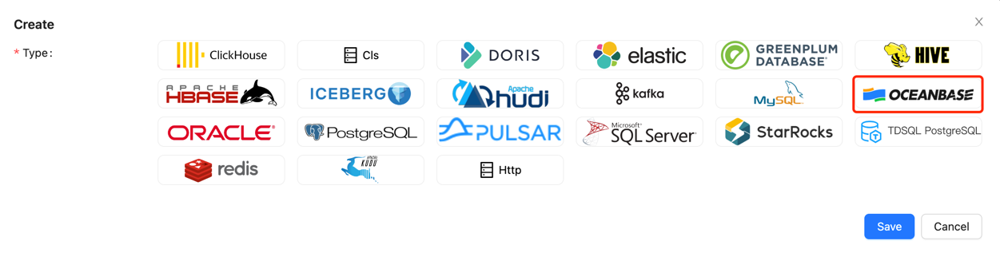
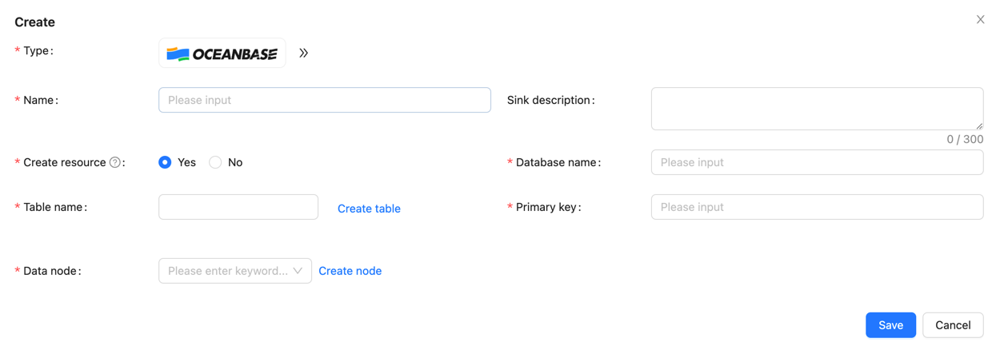
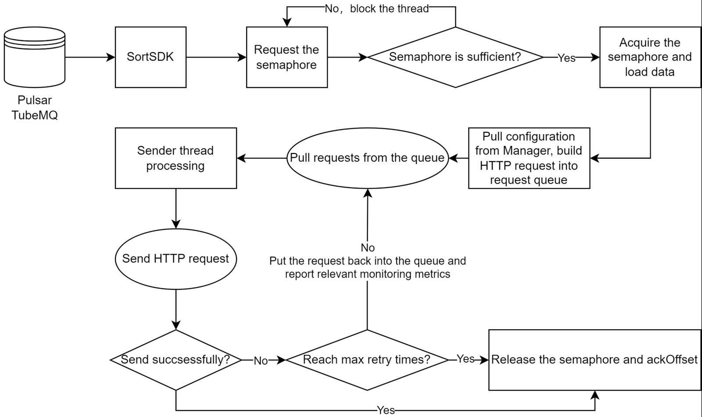

Apache InLong（应龙）recently released version 2.0.0, which addressed over 315 issues, including more than 6 major features and over 96 optimizations. 
This version primarily completed support for the Transform SDK, OceanusBase data source management, adaptive resource allocation for Sort, support for Transform in SortStandalone ES Sink, 
HTTP output for SortStandalone, and OpenTelemetry log reporting.

After the release of 2.0.0, Apache InLong introduced new transformation capabilities, enhanced support for the Agent Pulsar Source, 
enriched the capabilities and applicable scenarios of Sort, and optimized the display of the Apache Dashboard, as well as addressing various issues 
and user experience concerns encountered during the operation and maintenance of InLong.
<!--truncate-->

## About Apache InLong
As the industry's first one-stop, full-scenario, open-source massive data integration framework, Apache InLong provides automatic, safe, reliable, and high-performance data transmission capabilities to facilitate businesses to build stream-based data analysis, modeling, and applications quickly. At present, InLong is widely used in various industries such as advertising, payment, social networking, games, artificial intelligence, etc., serving thousands of businesses, among which the scale of high-performance scene data exceeds 1 trillion lines per day, and the scale of high-reliability scene data exceeds 10 trillion lines per day.

The core keywords of InLong project positioning are "one-stop" and "massive data". For "one-stop", we hope to shield technical details, provide complete data integration and support services, and implement out-of-the-box; With its advantages, such as multi-cluster management, it can stably support larger-scale data volumes based on trillions of lines per day.

## 2.0.0 Overview
Apache InLong（应龙）recently released version 2.0.0, which addressed over 315 issues, including more than 6 major features and over 96 optimizations.
This version primarily completed support for the Transform SDK, OceanusBase data source management, adaptive resource allocation for Sort, support for Transform in SortStandalone ES Sink,
HTTP output for SortStandalone, and OpenTelemetry log reporting.

After the release of 2.0.0, Apache InLong introduced new transformation capabilities, enhanced support for the Agent Pulsar Source,
enriched the capabilities and applicable scenarios of Sort, and optimized the display of the Apache Dashboard, as well as addressing various issues
and user experience concerns encountered during the operation and maintenance of InLong.

### Agent Module
- Optimized the Pulsar Source implementation to fix issues with inaccurate consumption offsets.
- Added support for data re-insertion filtering capabilities.
- Introduced the ability to report Agent status.
- Updated the implementations for Redis, Oracle, SQLServer, and MQTT data sources.

### Dashboard Module
- Added an offline synchronization configuration page for data synchronization.
- Optimized the style and structure of data preview.
- Introduced a heartbeat display page for cluster node management.
- Added cluster name display to data source information.
- Supported custom ASCII code options for source data field delimiters.
- Merged metric items with other items on the module review page.
- Enabled delete operations for cluster management and template management.
- Fixed errors in data preview.
- Added support for OceanBase data sources.

### Manager Module
- Added support for OceanusBase data source management.
- Introduced TubeMQ configuration capabilities for Sort Standalone.
- Supported asynchronous installation of Agent and the display of Agent installation logs.
- Enabled configuration for HTTP type Sink.
- Supported paginated queries for detailed information on sorting tasks.
- Data preview now supports KV data types, escape characters, and filtering Tube data by StreamId.
- Added data filtering functionality.
- Permission optimization: Regular users are not allowed to modify Group information if they are not the Owner.
- Fixed issues with offline synchronization updates.
- Resolved alignment issues in data preview fields.

### SDK Module
- Transform supports data partitioning using GroupBy semantics.
- Transform can parse Map nodes in JSON or PB data.
- Transform JSON data source supports multidimensional arrays.
- Transform supports ELT functionality.
- Transform supports configuration and parsing of Transform annotations.
- Transform supports various data source types: JSON, PB, XML, YAML, BSON, AVRO, ORC, PARQUET, etc.
- Transform supports arithmetic functions: ceil, floor, sin, cos, cot, tanh, cosh, asin, atan, mod, etc.
- Transform supports date and time functions: year, quarter, month, week, from_unixtime, unix_timestamp, to_timestamp, etc.
- Transform supports string functions: substring, replace, reverse, etc.
- Transform supports common encoding and encryption functions: MD5, ASCII, SHA.
- Transform supports numeral and bitwise operation functions: HEX, Bitwise.
- Transform supports compression and decompression functions: GZIP, ZIP, etc.
- Transform includes other common functions: case conversion, IN, NOT IN, EXISTS, etc.
- DataProxy Java SDK: Shaded Native Library to reduce conflicts with other SDKs.
- DataProxy Java SDK: Optimized sending jitter issue during metadata changes.
- DataProxy CPP SDK: Improved memory management and optimized build scripts.
- DataProxy CPP SDK: Supports multiple protocols.
- DataProxy CPP SDK: Added message manager and optimized data reception capabilities.
- DataProxy Python SDK: Updated build scripts and supports skipping the CPP SDK build step.

### Sort Module
- Adjust resources required for Sort tasks based on data scale.
- Added support for OceanusBase data source.
- Flink 1.18 now supports Elasticsearch 6 and Elasticsearch 7 connectors.
- SortStandalone Elasticsearch Sink supports Transform.
- SortStandalone supports HTTP Sink and batch sorting.
- Connector supports OpenTelemetry log reporting.
- Optimized producer parameters for Kafka connector.
- Added end-to-end test cases for Flink 1.15.

### Audit Module
- Supports global memory control for the audit SDK.
- Optimized daily dimension audit data statistics.
- Supports forking subprocesses in DataProxy CPP SDK.
- Audit SDK allows custom local IP settings.
- Unified audit aggregation interval range.
- Resolved Protobuf version conflicts between Audit SDK and other components.

## 2.0.0 Feature Introduction

### New Transform Capabilities
InLong Transform enhances InLong's ability to expand access and distribution capabilities by adapting to a wider range of data protocols and reporting scenarios on the input side,
while accommodating complex and diverse data analysis scenarios on the output side. This improves data quality and collaboration, providing computing capabilities such as connection, 
aggregation, filtering, grouping, value extraction, and sampling, all decoupled from the computation engine.

It simplifies the pre-processing operations for users reporting data, lowers the barriers to data usage, and streamlines the pre-operations required before users can start analyzing data. 
The focus is on the business value of data, achieving the goal of making data "visible and usable."

Transform has a wide range of application scenarios. Here are some typical examples:
- Data Cleaning: During the data integration process, Transform capabilities can effectively eliminate errors, duplicates, and inconsistencies in data from different sources, improving data quality.
- Data Fusion: Combining data from different sources for unified analysis and reporting. Transform capabilities can handle various formats and structures of data, achieving data fusion and integration.
- Data Standardization: Converting data into a unified standard format for cross-system and cross-platform data analysis. Transform capabilities help enterprises achieve data standardization and normalization.
- Data Partitioning and Indexing: To enhance the performance of data queries and analysis, Transform capabilities can dynamically adjust field values for data partitioning and indexing, thereby improving data warehouse performance.
- Data Aggregation and Calculation: In the data analysis process, Transform capabilities can perform complex data aggregation and calculations to extract valuable business information, covering multidimensional data analysis.

Main Features of Transform：
- Support for Rich Data Protocols: Enables integration with a variety of data protocols.
- Decoupled from Computing Engine: Allows flexibility in processing without being tied to a specific computing engine.
- Support for Rich Transformation Functions: Provides a wide range of functions for data transformation.
- Lossless and Transparent Changes: Ensures that changes can be made without data loss or noticeable impact.
- Automatic Scaling: Supports dynamic scaling up and down based on workload.

Currently, Transform supports a variety of data formats and custom functions, allowing users to flexibly process data using SQL. 
Special thanks to contributors such as @luchunliang, @vernedeng, @emptyOVO, @ying-hua, @Zkplo, @MOONSakura0614, and @Ybszzzziz for their efforts. For more details, please refer to [Transform SDK Issues](https://github.com/aloyszhang/inlong/blob/master/CHANGES.md#sdk)。

### Community Documentation Restructuring
With the continuous development of the InLong community, the capabilities of InLong are also constantly enhancing. However, there have been issues with missing or outdated community documentation. 
To address this, the InLong community has initiated a restructuring of the community documentation to better assist users in understanding and utilizing InLong.

Main Content Includes:
  - Optimized Document Structure: Better organization of document content. 
  - Enhanced Quick Start Examples:
    - Offline synchronization usage examples
    - Transform SDK usage examples
    - Data subscription usage examples
    - HTTP message reporting usage examples
  - Improved SDK Documentation:
    - DataProxy: C++, Java, Golang, Python SDKs, and HTTP data reporting manuals
    - TubeMQ SDK: C++, Java, Golang SDK usage manuals
  - Enhanced Development Guidelines:
    - Code compilation guidelines
    - Documentation for data protocols of each component
    - Documentation for extension development of each component
    - REST API documentation
  - Improved Management Articles: Documentation on user management, approval management, tenant management, node management, cluster management, tag management, template management, and agent management.

Currently, the community documentation has seen significant improvements in usage guidelines, development guidelines, and management guidelines. 
Special thanks to contributors such as @aloyszhang, @fuweng11, @vernedeng, @luchunliang, @gosonzhang, @doleyzi, @baomingyu, @justinwwhuang, and @wohainilaodou for their contributions to the documentation improvement.

### OceanBase Data Source
OceanBase Database is a distributed relational database known for its high availability and scalability, making it suitable for large-scale data storage and processing scenarios. 
The InLong 2.0.0 version has added support for the OceanBase data source, allowing data to be imported from various sources into OceanBase.

The management of OceanBase data nodes is similar to that of MySQL:

The configuration includes key information such as:
- Node Name
- Type (OceanBase)
- Username
- Password
- Address

Below is an example configuration for writing data to OceanBase:

First, create the data target, selecting the type as: `OceanBase`

Then, fill in the relevant information:

Thank you to @xxsc0529 for their contributions to this feature. For more details, please refer to INLONG-10700, INLONG-10701, and INLONG-10704.

### Dynamic Resource Calculation for Sort Tasks
The total resources (task parallelism) for the Flink Sort Job are derived from the configuration file flink-sort-plugin.properties. 
This means that all submitted sorting jobs will use the same amount of resources. When the data scale is large, resources may be insufficient, while with smaller data scales, resources may be wasted.

Therefore, dynamically calculating the required resource quantity based on data volume is a highly needed feature. 
InLong now supports dynamically calculating the total resources required for tasks based on data volume, involving two core data points:
- Task Data Volume: The data volume relies on the auditing system, derived from the average data volume of `DataProxy` over the past hour as recorded by the auditing system.
- Single-Core Processing Capacity: The processing capacity per core depends on the maximum number of messages configured for a single core in the `flink-sort-plugin.properties` file.

With these two data points, the total resources required for a task can be calculated. This feature supports a toggle, allowing users to enable or disable it as needed.

Thank you to @PeterZh6 for their contributions to this feature. For more details, please refer to INLONG-10916.

### SortStandalone Supports HTTP Sink
Inlong SortStandalone is responsible for consuming data from MQ and distributing it to various data storage systems, supporting multiple storage options such as ElasticSearch and CLS.
Compared to SortFlink, SortStandalone offers higher performance and lower latency, making it suitable for scenarios with stringent performance requirements.

The HTTP protocol is a widely used communication protocol. SortStandalone supports HTTP output, allowing data to be sent to HTTP interfaces without needing to focus on the specific storage implementation, 
thus providing greater flexibility to adapt to different business scenarios.

The processing flow for HTTP output is as follows:

HTTP output has the following characteristics:
- SortSDK is responsible for consuming data from MQ.
- Supports semaphore-based flow control capabilities.
- Metadata management relies on Manager, supporting dynamic updates.
- The output protocol is HTTP, decoupling the specific storage implementation.
- Supports retry strategies.

- Thank you to @yfsn666 and @fuweng11 for their contributions to this feature. For more details, please refer to INLONG-10831 and INLONG-10884.

## Summary and Future Plans
In version 2.0.0, the Apache InLong community has:
- Introduced the heavyweight feature Transform SDK, which supports multiple data formats and a variety of commonly used UDFs, and has been integrated into the SortStandalone ES Sink.
- Completely restructured the community documentation, optimizing the document structure, enhancing quick start examples, and improving development guidelines, thereby lowering the usage and development threshold for users.
- Added support for the OceanBase data source, enabling data import from various sources into OceanBase.
- Enabled dynamic resource calculation for Sort tasks.
- Add HTTP sink support in SortStandalone.

- Additionally, the Pulsar data source collection capability has been optimized, and improvements have been made to the Dashboard display, with enhancements in auditing capabilities and overall stability.

In future versions, InLong will continue to:
- Support more data source collection capabilities.
- Enrich Flink 1.15 and 1.18 connectors.
- Continuously enhance Transform capabilities.
- Provide real-time synchronization support for more data sources and targets.
- Advance offline integration, supporting third-party scheduling engines.
- Optimize SDK capabilities and user experience.
- Improve Dashboard experience.

We are always looking forward to more developers participating and contributing!