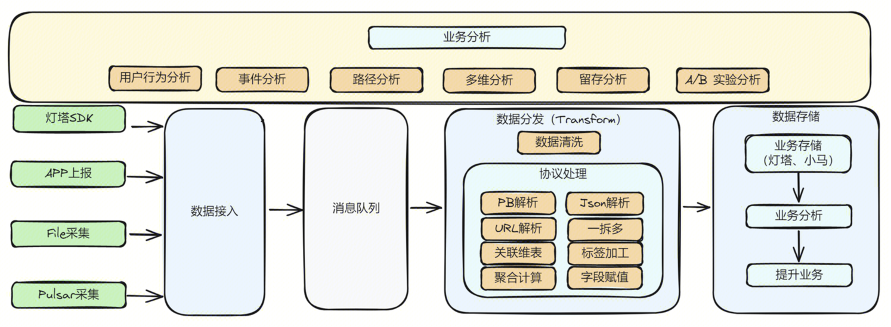
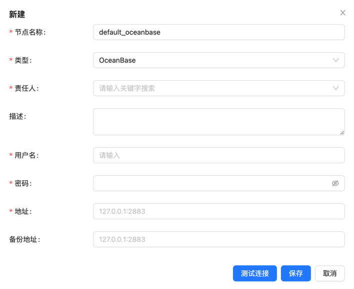
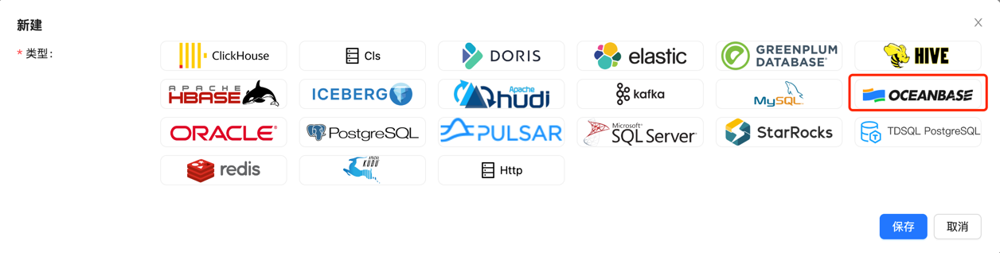
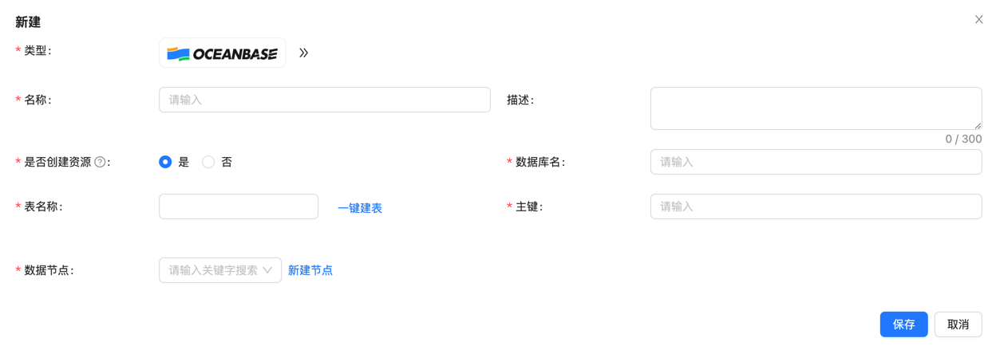

Apache InLong（应龙）最近发布了 2.0.0 版本，该版本关闭了 315+ 个 Issues ，包括 6+ 个大特性和 96+ 个优化，主要完成了支持 Transform SDK、 OceanusBase 数据源管理、Sort 资源自适应、SortStandalone ES Sink 支持 transform、SortStandalone HTTP 接出、OpenTelemetry 日志上报等特性。
2.0.0 发布后，Apache InLong 新增了 transform 能力， 完善了Agent Pulsar Source 的支持，丰富了 Sort 的能力和适用场景，同时优化了 Apache Dashboard 的展示，以及InLong 运营、运维过程中遇到的一些问题和使用体验。
<!--truncate-->

## 关于 Apache InLong
作为业界首个一站式、全场景海量数据集成框架，Apache InLong（应龙）提供了自动、安全、可靠和高性能的数据传输能力，方便业务快速构建基于流式的数据分析、建模和应用。目前 InLong 正广泛应用于广告、支付、社交、游戏、人工智能等各个行业领域，服务上千个业务，其中高性能场景数据规模超百万亿条/天，高可靠场景数据规模超十万亿条/天。

InLong 项目定位的核心关键词是“一站式”、“全场景”和“海量数据”。对于“一站式”，我们希望屏蔽技术细节、提供完整数据集成及配套服务，实现开箱即用；对于“全场景”，我们希望提供全方位的解决方案，覆盖大数据领域常见的数据集成场景；对于“海量数据”，我们希望通过架构上的数据链路分层、全组件可扩展、自带多集群管理等优势，在百万亿条/天的基础上，稳定支持更大规模的数据量。

## 2.0.0 版本总览
Apache InLong（应龙）最近发布了 2.0.0 版本，该版本关闭了 315+ 个 Issues ，包括 6+ 个大特性和 96+ 个优化，主要完成了支持 Transform SDK、 OceanusBase 数据源管理、Sort 资源自适应、SortStandalone ES Sink 支持 transform、SortStandalone HTTP 接出、OpenTelemetry 日志上报等特性。
2.0.0 发布后，Apache InLong 新增了 transform 能力， 完善了Agent Pulsar Source 的支持，丰富了 Sort 的能力和适用场景，同时优化了 Apache Dashboard 的展示，以及InLong 运营、运维过程中遇到的一些问题和使用体验。

### Agent 模块
- 优化 Pulsar Source 实现，修复消费位点不准确问题
- 支持数据补录过滤能力
- 支持 Agent 状态上报能力
- 更新 Redis、Oracle、SQLServer、MQTT 数据源实现

### Dashboard 模块
- 数据同步增加离线同步配置页面
- 优化数据预览样式结构
- 集群节点管理增加心跳显示页面
- 数据源信息显示添加集群名称
- 源数据字段分隔符支持自定义 ASCII 代码选项
- 模块审核页面指标项与其他项合并
- 集群管理和模板管理支持删除操作
- 修复数据预览错误
- 支持 OceanBase 数据源

### Manager 模块
- 支持 OceanusBase 数据源管理
- 增加 Sort Standalone 的 TubeMQ 配置能力
- 支持 Agent 异步安装、支持 Agent 安装日志展示
- 支持配置 HTTP 类型 Sink
- 支持分页查询排序任务详细信息
- 数据预览支持 KV 数据类型、支持转义字符、支持根据 StreamId 过滤 Tube 数据
- 支持数据过滤功能
- 权限优化：普通用户不是 Owner 时不允许修改 Group 信息
- 修复离线同步更新异常
- 修复数据预览字段未对齐问题

### SDK 模块
- Transform 支持使用 GroupBy 语义进行数据分片
- Transform 支持解析 JSON 或 PB 数据中的 Map 节点
- Transform JSON 数据源支持多维数组
- Transform 支持 ELT 功能
- Transform 支持 Transform 注解配置以及解析
- Transform 支持多种类型数据源：JSON、PB、XML、YAML、BSON、AVRO、ORC、PARQUET 等
- Transform 支持算术函数：ceil、floor、sin、cos、cot、tanh、cosh、asin、ata、mod 等
- Transform 支持日期和时间函数：year, quarter, month, week, form_unixtime、unix_timestamp、 to_timestamp 等
- Transform 支持字符串函数：substring, replace, reverse 等
- Transform 支持常用编码以及加密函数：MD5、ASCII、SHA
- Transform 支持进制和位运算函数：HEX、Bitwise
- Transform 支持压缩和解压缩函数: GZIP、ZIP 等
- Transform 其他常用函数：大小写转换、IN、NOT IN、EXISTS 等
- DataProxy Java SDK: Shaded Native Library 以减少与其他 sdk 的冲突
- DataProxy Java SDK: 优化元数据变更时的发送抖动问题
- DataProxy CPP SDK: 优化内存管理、优化编译脚本
- DataProxy CPP SDK: 支持多种协议
- DataProxy CPP SDK: 添加消息管理器、优化接收数据的能力
- DataProxy Python SDK: 更新构建脚本，并且支持跳过 CPP SDK 构建步骤

### Sort 模块
- 根据数据规模调整 Sort 任务需要的资源
- 支持 OceanusBase 数据源
- Flink 1.18 中支持 Elasticsearch6 和 Elasticsearch7 connector
- SortStandalone Elasticsearch Sink 支持 Transform
- SortStandalone 支持 HTTP Sink，并且支持批量排序
- Connector 支持 OpenTelemetry 日志上报
- 优化 Kafka connector 生产者参数
- 增加 Flink 1.15 端到端测试用例

### Audit 模块
- 支持审核 SDK 全局内存控制
- 优化天维度审计数据统计
- 支持 DataProxy CPP SDK 的 fork 子进程
- 审计 SDK 支持自定义设置本地 IP
- 统一审计聚合间隔范围
- 解决 Audit SDK 与其他组件 Protobuf 版本冲突

## 2.0.0 版本特性介绍

### 新增 Transform 能力
InLong Transform 助力 InLong 扩展接入分发能力，接入侧适配更丰富的数据协议和上报场景，分发侧适配复杂多样的数据分析场景，
提高数据质量和数据协作，提供连接、聚合、筛选、分组、取值、抽样等和计算引擎解耦的计算能力，简化用户上报数据的前置操作，降低数据使用门槛，
简化用户开始分析数据前的前置操作，聚焦数据的业务价值，实现数据“可见即可用”。

Transform 具有非常广泛的应用场景，以下是一些典型的应用场景：
- 数据清洗：在数据集成过程中，需要对来自不同源的数据进行清洗，以消除数据中的错误、重复和不一致。Transform 能力可以帮助企业更有效地进行数据清洗，提高数据质量
- 数据融合：将来自不同数据源的数据融合在一起，以便进行统一的分析和报告。Transform 能力可以处理不同格式和结构的数据，实现数据的融合和集成
- 数据标准化：将数据转换为统一的标准格式，以便进行跨系统和跨平台的数据分析。Transform 能力可以帮助企业实现数据的标准化和规范化
- 数据分区和索引：为了提高数据查询和分析的性能，对数据进行分区和建立索引。Transform 能力可以实现分区和索引的字段值动态调整，从而提高数据仓库的性能
- 数据聚合和计算：在数据分析过程中，通过对数据进行聚合和计算，提取有价值的业务信息。Transform 能力可以实现复杂的数据聚合和计算，覆盖多维度的数据分析
- 数据安全和隐私保护：在数据集成过程中，需要确保数据的安全和隐私。Transform 能力可以实现数据的脱敏、加密和授权管理，保护数据的安全和隐私
- 跨团队数据共享：出于数据安全考虑，只共享数据流的筛选子集；出于数据依赖解耦考虑，和合作团队约定数据接口，动态调整多流合并到数据流接口

Transform 的主要特性如下：
- 支持丰富的数据协议
- 计算引擎解耦
- 支持丰富的转换函数
- 支持无损无感变更
- 支持自动扩缩容

目前 Transform 已经在支持了丰富的数据格式以及丰富的自定义函数，用户可以通过 SQL 的方式灵活的对数据进行处理，感谢 @luchunliang, @vernedeng, @emptyOVO, @ying-hua, @Zkplo, @MOONSakura0614, @Ybszzzziz 等同学的贡献，
详情可以参考 [Transform SDK Issues](https://github.com/aloyszhang/inlong/blob/master/CHANGES.md#sdk)。

### 社区文档重构
随着 InLong 社区的不断发展，InLong 能力也在不断增强，社区文档存在缺失或者更新不及时的问题，针对于这个问题， InLong 社区发起了对于社区文档的重构，以便更好地帮助用户了解和使用 InLong。

主要的内容包括：
- 优化文档结构，更好地组织文档内容
- 快速开始使用示例完善：
  - 离线同步使用示例
  - Transform SDK 使用示例
  - 数据订阅使用示例
  - Http 消息上报使用示例
- SDK 使用文档完善
  - DataProxy：C++、Java、Golang、Python SDK 以及 Http 数据上报使用手册
  - TubeMQ SDK：C++、Java、Golang SDK 使用手册
- 开发指引完善
  - 代码编译指引
  - 各组件数据协议文档
  - 各组件扩展开发文档
  - REST API
- 管理文章完善：用户完善、审批管理、租户管理、节点管理、集群管理、标签管理、模版管理、agent 管理文档。

目前社区文档在使用指引、开发指引、管理指引等方面都有了较大的提升，感谢 @aloyszhang, @fuweng11, @vernedeng, @luchunliang, @gosonzhang, @doleyzi, @baomingyu, @justinwwhuang, @wohainilaodou 等同学对文档重构的贡献。

### 新增 OceanBase 数据源
OceanBase Database 是一个分布式关系型数据库，具有高可用、高扩展性等特点，适用于大规模数据存储和处理场景， InLong 2.0.0 版本增加了对 OceanBase 数据源的支持，可以将数据从数据源导入到 OceanBase 中。
OceanBase 数据节点的管理和 MySQL 类似：

包含：节点名称、类型（OceanusBase）、用户名、密码、地址等关键信息。

下图是一个向 OceanBase 写入数据的配置示例：

首先创建数据目标，类型选择为 `OceanBase`

然后填写相关信息，如下图所示：

感谢 @xxsc0529 对此功能的贡献，具体请参考 INLONG-10700、INLONG-10701、INLONG-10704。

### 支持动态计算 Sort 任务的资源
Flink Sort Job 的资源总量（任务并行度）来自于配置文件 `flink-sort-plugin.properties`，这意味着所有提交的排序作业都会使用相同数量的资源。
当数据规模大时，资源可能不足，当数据规模小时，资源可能浪费。

因此，根据数据量动态计算资源数量是一个非常需要的功能。 InLong 现在支持根据数据量动态计算任务所需要的资源总量，涉及两个核心数据：
- 任务的数据量：数据量依赖于审计系统，取自审计系统统计到的 `DataProxy` 过去一小时平均数据量
- 单核的处理能力：单核的处理能力依赖于配置文件 `flink-sort-plugin.properties` 中配置的一个核的最大消息数

有了这两个数据，就可以计算出一个任务所需要的资源总量。 该功能支持开关，可以根据需要选择打开或关闭。

感谢 @PeterZh6 对此功能的贡献，具体请参考 INLONG-10916。

### SortStandalone 支持  HTTP 接出
Inlong SortStandalone 负责从 MQ 消费数据，然后分发到不同数据存储的模块，支持 ElasticSearch、CLS 等多种数据存储。

相比于 SortFlink, SortStandalone 具有更高的性能和更低的延迟，适用于对性能要求较高的场景。

Http 协议是被广泛使用的一种通信协议，SortStandalone 支持 HTTP 接出，可以将数据发送到 HTTP 接口，而不需要关心具体的存储实现，可以更加灵活的适应不同的业务场景。

Http 接出的处理流程如下：

Http 接出具备以下特点：
- SortSDK 负责从 MQ 消费数据
- 支持基于信号量的流量控制能力
- 元数据管理以来 Manager，支持动态更新
- 接出协议为 Http，解耦具体存储实现
- 支持重试策略

感谢 @yfsn666 和 @fuweng11 对此功能的贡献，具体请参考 INLONG-10831 和 INLONG-10884。

## 总结与未来规划
在 2.0.0 版本中，Apache InLong 社区
- 引入了重量级特性 Transform SDK，已经支持多种数据格式以及大量常用 UDF，并且集成到了 SortStandalone ES Sink 中
- 社区文档整体进行了重构，优化了文档结构，完善了快速开始使用示例以及开发指引完善，降低了用户的使用和开发门槛
- 新增 OceanBase 数据源，支持将数据从数据源导入到 OceanBase 中
- 支持动态计算 Sort 任务的资源
- SortStandalone 支持 HTTP 接出

另外优化了 Pulsar 数据源采集能力、优化了 Dashboard 展示效果、审计能力和稳定性也得到了提升。

在后续的版本中，InLong 将继续：
- 支持更多数据源采集能力
- 丰富 Flink 1.15、1.18 Connector 
- 持续丰富 Transform 能力
- 实时同步支持更多数据源、数据目标
- 推进离线集成，支持第三方调度引擎
- 优化 SDK 能力和使用体验
- 优化 Dashboard 体验

期待更多开发者参与贡献。
